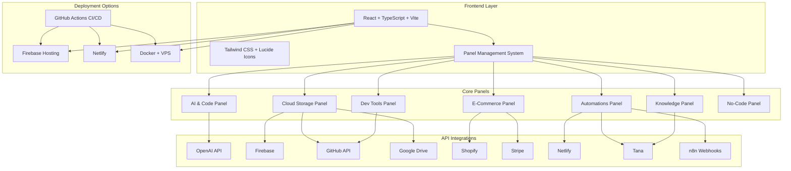

# CreationStation-GitHubEdition

A comprehensive full-stack development workstation that combines AI-powered code generation, cloud storage management, e-commerce tools, automation workflows, and knowledge management in a unified holographic interface.


## 🚀 One-Command Setup

Get started instantly with our automated setup script:

```bash
curl -sSL https://raw.githubusercontent.com/Troyboy911/creationstation/main/setup.sh | bash
```

Or clone and setup manually:

```bash
git clone https://github.com/Troyboy911/creationstation.git
cd creationstation
chmod +x setup.sh
./setup.sh
```

## 🏗️ System Architecture



## 🎯 Features

### 🤖 AI & Code Panel
- **Text-to-Code Generation**: Convert natural language to functional code
- **Image/Video Generation**: AI-powered media creation
- **Code Analysis**: Intelligent code review and optimization
- **Multiple AI Models**: Support for OpenAI GPT models

### ☁️ Cloud Storage Panel
- **Multi-Platform Integration**: Google Drive, Firebase, GitHub, Dropbox
- **File Synchronization**: Real-time sync across platforms
- **Version Control**: Git integration with GitHub
- **Backup Management**: Automated backup strategies

### 🛠️ Dev Tools Panel
- **Container Management**: Docker integration
- **CI/CD Pipeline**: GitHub Actions automation
- **Development Server**: Local development environment
- **Code Editor Integration**: VS Code and terminal access

### 🛍️ E-Commerce Panel
- **Shopify Integration**: Product and inventory management
- **Analytics Dashboard**: Sales and customer insights
- **Payment Processing**: Stripe integration
- **Order Management**: Complete e-commerce workflow

### ⚡ Automations Panel
- **Workflow Automation**: n8n webhook integration
- **Deployment Automation**: One-click deployments
- **Task Scheduling**: Automated routine tasks
- **Custom Recipes**: Build your own automation workflows

### 📚 Knowledge Panel
- **Note Management**: Organized knowledge base
- **Tana Integration**: Advanced note-taking and linking
- **Search & Discovery**: Intelligent content search
- **Export Capabilities**: Multiple export formats

### 🎨 No-Code Panel
- **Visual Flow Editor**: Drag-and-drop workflow creation
- **Rich Text Editor**: Advanced document editing
- **Template System**: Pre-built workflow templates
- **Integration Hub**: Connect with external services

## 🔧 Tech Stack

### Frontend
- **React 18** with TypeScript
- **Vite** for fast development and building
- **Tailwind CSS** for styling
- **Lucide React** for icons
- **Context API** for state management

### Backend & Database
- **Firebase** (Firestore, Auth, Hosting, Functions)
- **NeonDB** (PostgreSQL alternative)
- **Serverless Functions** for API endpoints

### Deployment
- **Firebase Hosting** (Primary)
- **Netlify** (Alternative)
- **Docker** + VPS (Advanced)
- **GitHub Actions** (CI/CD)

### Integrations
- **OpenAI API** - AI capabilities
- **Firebase** - Backend services
- **GitHub API** - Repository management
- **Google APIs** - Drive, OAuth, Analytics
- **Shopify API** - E-commerce
- **Stripe API** - Payments
- **Netlify API** - Deployment
- **Tana API** - Knowledge management
- **n8n Webhooks** - Automation

## 📋 Prerequisites

- **Node.js** 18+ 
- **npm** or **yarn**
- **Git** (for version control)
- **Docker** (optional, for containerized deployment)

## 🚀 Quick Start

### 1. Clone & Setup
```bash
git clone https://github.com/Troyboy911/creationstation.git
cd creationstation
./setup.sh
```

### 2. Configure Environment
The setup script will guide you through configuring your API keys. You can also manually edit `.env.local`:

```env
# Essential APIs
VITE_OPENAI_API_KEY=your_openai_api_key
VITE_FIREBASE_API_KEY=your_firebase_api_key
VITE_GITHUB_TOKEN=your_github_token
VITE_GOOGLE_CLIENT_ID=your_google_client_id

# Optional APIs
VITE_SHOPIFY_API_KEY=your_shopify_api_key
VITE_STRIPE_PUBLISHABLE_KEY=your_stripe_key
VITE_NETLIFY_ACCESS_TOKEN=your_netlify_token
```

### 3. Start Development
```bash
npm run dev
```

Visit `http://localhost:5173` to access your CreationStation workstation.

## 🚀 Deployment

### Firebase Hosting (Recommended)
```bash
npm install -g firebase-tools
firebase login
firebase init hosting
npm run build
firebase deploy
```

### Netlify
```bash
npm run build
# Deploy dist/ folder to Netlify
```

### Docker
```bash
docker build -t creationstation .
docker run -p 3000:80 creationstation
```

### Docker Compose
```bash
docker-compose up
```

## 🔧 Development

### Available Scripts
- `npm run dev` - Start development server
- `npm run build` - Build for production
- `npm run preview` - Preview production build
- `npm run lint` - Run ESLint
- `npm run type-check` - Run TypeScript checks

### Project Structure
```
creationstation/
├── src/
│   ├── components/
│   │   ├── Navigation/     # Top navigation
│   │   ├── Sidebar/        # Tool panel sidebar
│   │   ├── Panels/         # Feature panels
│   │   └── Workspace/      # Main workspace
│   ├── contexts/           # React contexts
│   ├── config/             # Configuration
│   └── types/              # TypeScript types
├── public/                 # Static assets
├── .env.example           # Environment template
├── firebase.json          # Firebase config
├── netlify.toml          # Netlify config
├── Dockerfile            # Docker config
└── setup.sh              # One-command setup
```

## 🔐 API Configuration

### Required APIs
1. **OpenAI API** - Get from [OpenAI Platform](https://platform.openai.com/api-keys)
2. **Firebase** - Setup at [Firebase Console](https://console.firebase.google.com/)
3. **GitHub Token** - Generate at [GitHub Settings](https://github.com/settings/tokens)
4. **Google OAuth** - Configure at [Google Cloud Console](https://console.cloud.google.com/)

### Optional APIs
- **Shopify** - For e-commerce features
- **Stripe** - For payment processing
- **Netlify** - For deployment automation
- **Tana** - For advanced knowledge management
- **n8n** - For workflow automation

## 🤝 Contributing

1. Fork the repository
2. Create a feature branch: `git checkout -b feature/amazing-feature`
3. Commit your changes: `git commit -m 'Add amazing feature'`
4. Push to the branch: `git push origin feature/amazing-feature`
5. Open a Pull Request

## 📄 License

This project is licensed under the MIT License - see the [LICENSE](LICENSE) file for details.

## 🙏 Acknowledgments

- Built with [React](https://reactjs.org/) and [Vite](https://vitejs.dev/)
- UI components from [Tailwind CSS](https://tailwindcss.com/)
- Icons from [Lucide React](https://lucide.dev/)
- Deployed on [Firebase](https://firebase.google.com/) and [Netlify](https://netlify.com/)

## 📞 Support

For support, email troyg1982@gmail.com or create an issue in this repository.

---

**CreationStation-GitHubEdition** - Your complete development workstation in one holographic interface. 🚀
